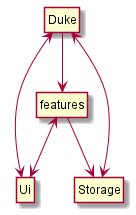

# Developer Guide

## Table of Contents

[1. Introduction](#1-introduction)

[2. Design](#2-design)  
&nbsp;&nbsp;&nbsp;&nbsp;[2.1 Architecture](#21-architecture)  
&nbsp;&nbsp;&nbsp;&nbsp;[2.2 UI Class](#22-ui-class)

[3. Implementation](#3-implementation)  
&nbsp;&nbsp;&nbsp;&nbsp;[3.10 Add New Task](#310-add-new-task)  
&nbsp;&nbsp;&nbsp;&nbsp;[3.11 Delete a Task](#311-delete-a-task)  
&nbsp;&nbsp;&nbsp;&nbsp;[3.11 Add Zoom Link](#312-add-zoom-link)

[4. Product scope](#4-product-scope)    
&nbsp;&nbsp;&nbsp;&nbsp;[4.1 Target user profile](#41-target-user-profile)   
&nbsp;&nbsp;&nbsp;&nbsp;[4.2 Value proposition](#42-value-proposition)  

[5. User Stories](#5-user-stories)

[6. Non-Functional Requirements](#6-non-functional-requirements)

[7. Glossary](#7-glossary)  

[8. Instructions for manual testing](#8-instructions-for-manual-testing)  

---
## 1. Introduction

UniTracker is a one-stop application for NUS students to keep track of their work in school. It
comprises 4 key features (ModuleInfo, SU Calculator/Simulator, TaskManager, Links) that helps to organise all information they
need in one place. Users are allowed to add and edit module information, tasks, zoom links to suit
their needs. This product is optimal for students who prefer Command Line Interface (CLI) over
Graphical User Interface (GUI).
---
## 2. Design

{Describe the design and implementation of the product. Use UML diagrams and short code snippets where applicable.}

### 2.1 Architecture

The `Duke` class contains the main method of our application. 
- At the start of the application, it initializes all the classes in sequence.

We have 5 main classes for our key features.
- `ModuleInfo`: contains methods for our module information features.
- `HelpGraduation`: contains methods for our SU calculator/simulator.
- `TaskManager`: contains methods for our task management features.
- `Links`: contains methods for our links features.
- `Storage`: Write data to, and loads data to hard disk
  

### 2.2 UI Class

This class handles the interactions with the user and contains the methods for system output.

---
## 3. Implementation

### 3.10 Add New Task

This feature allows the user to add tasks of type `task`, `assignment`, `midterm`, `final exam` to a task list.

All task types (except `Task`, which contains arguments 1, 2 and 5) contain 5 arguments upon creation:
1) `Module Code`   Example: `CS2113T`
2) `Task Description`   Example: `Finish v2.0`
3) `Date`   Example: `2021-03-21`
4) `Time`   Example: `23:59`
5) `Message`   Example: `Good job!`

A general explanation of how this feature works:

When the user calls this feature, the application will prompt them to input the arguments required for task creation.
This new task will then be stored into an `ArrayList` for future reference. The user has to input a valid format for the __date__ and __time__ field (refer to section 3.3.1 of User Guide or the example above),
and our application will convert it to a more readable format for the user. Using the example above,
- `2021-03-21` will be outputted as `Mar 21 2021`
- `23:59` will be outputted as `11:59 PM`

The user input for `Message` (argument 5 above) will be printed out when the user deleted the task, signalling completion.

### 3.11 Delete a Task

This feature allows the user to delete a task of type `task`, `assignment`, `midterm`, `final exam` from a task list.

A general explanation of how this feature works:

When the user calls this feature, the application will prompt them to choose the __task type__ (`task`, `assignment`, `midterm`, `final exam`) of the task they want to delete.
All existing tasks in the `ArrayList` for the task type they chose will then be printed out, and the user has to input the index of the task they want to delete.
The task they select will then be deleted from the `ArrayList`. 

The `Message` that the user inputted upon creation of this particular task will then be printed out. 

### 3.12 Add Zoom Link 
Given below is the sequence diagram for the feature:

---
## 4. Product scope

---
### 4.1 Target user profile

This product is for NUS students to help them to keep track/add/edit module information, and deadlines. This product is for users who prefer CLI over GUI.

---
### 4.2 Value proposition

Our product is user-specific as it allows users to customize and personalize their own module information and deadlines to suit their needs. 
Our product allows users to organize their own daily schedules and keep track of their deadlines all on one platform.

Information and materials of our various modules are on varying platforms; some could be on Luminus, or the professor's personal websites, or sent to us via email, or on Wiki.nus.
We want to solve the issue of being disorganized and confused over not knowing or remembering where certain information is. 

By using UniTracker, users will be able to store all necessary details on one platform 
so that they can keep track of commonly accessed information while keeping track of the tasks they have.

---
## 5. User Stories

*[This section will be completed in the future.]*  

|Version| As a ... | I want to ... | So that I can ...|
|--------|----------|---------------|------------------|
|v1.0|new user|see usage instructions|refer to them when I forget how to use the application|
|v2.0|user|find a to-do item by name|locate a to-do without having to go through the entire list|

---
## 6. Non-Functional Requirements

*[This section will be completed in the future.]*  
{Give non-functional requirements}

---
## 7. Glossary

*[This section will be completed in the future.]*  
* *glossary item* - Definition

---
## 8. Instructions for manual testing

*[This section will be completed in the future.]*  
{Give instructions on how to do a manual product testing e.g., how to load sample data to be used for testing}
